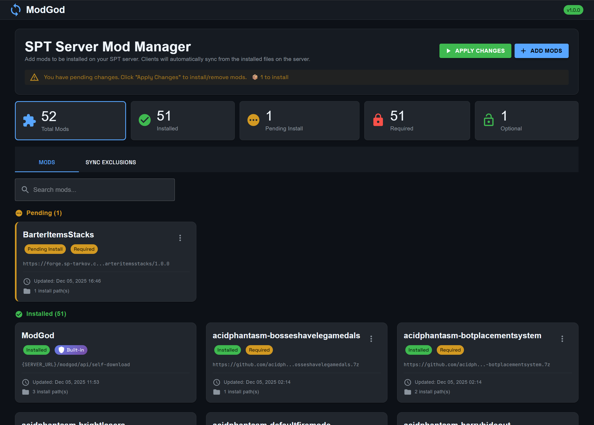
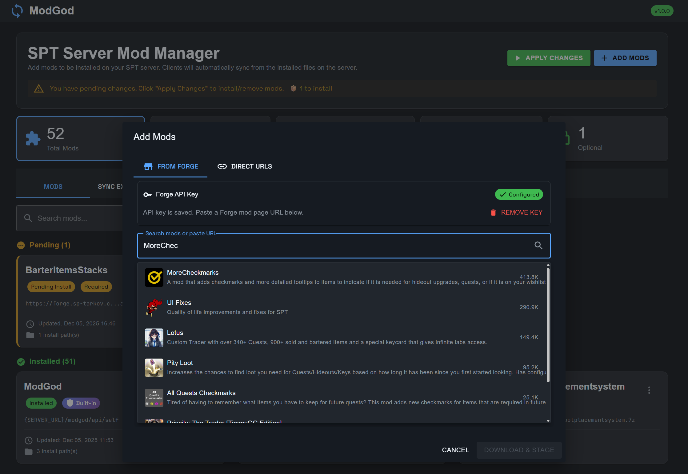
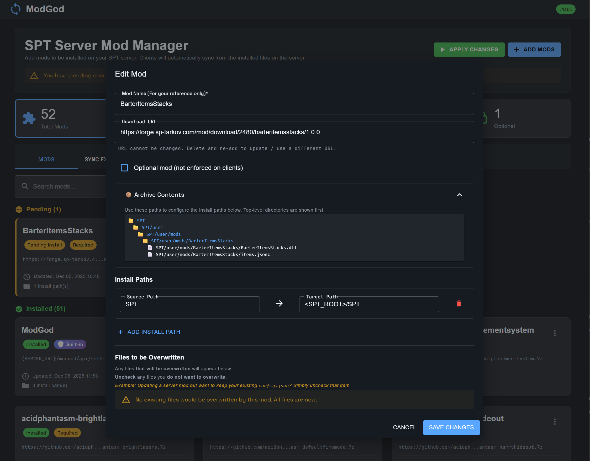
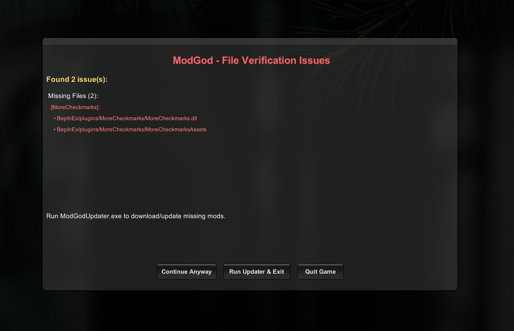
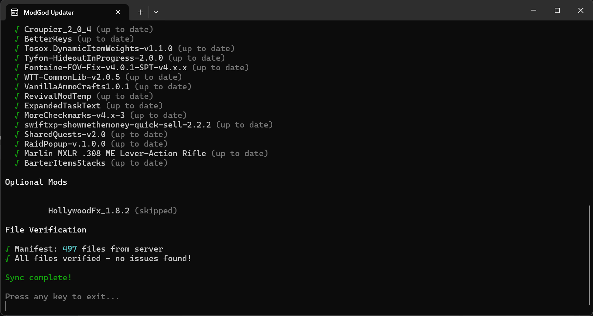

# 😇 SPT ModGod

<div align="center">

**Server-Side Mod Manager + Client Sync — The Complete End-to-End Solution for SPT Tarkov 4.0**

[](https://opensource.org/licenses/MIT)
[](https://www.sp-tarkov.com/)
[](https://dotnet.microsoft.com/)

_Manage your server mods from a web UI. Sync them to your players automatically._

</div>

---

## 📑 Table of Contents

- [Overview](#-overview)
- [Screenshots](#-screenshots)
- [Features](#-features)
- [Project Structure](#-project-structure)
- [Installation](#-installation)
- [Configuration](#-configuration)
- [Usage Guide](#-usage-guide)
- [Building from Source](#️-building-from-source)
- [API Endpoints](#-api-endpoints)
- [Linux Support](#-linux-support)
- [Troubleshooting](#-troubleshooting)
- [License](#-license)
- [Credits](#-credits)

---

## 🎯 Overview

ModGod is a complete mod synchronization solution for SPT Tarkov servers. It allows server administrators to manage mods through a sleek web interface, while automatically ensuring all connected clients have the correct mods and server files installed.

### Why ModGod?

- **Easy mod installation** - Install mods via Forge search or direct download URLs
- **Clients always up to date** - Clients automatically verify their mods match the server
- **Control synced files** - By default, everything in `BepInEx/plugins` and `SPT/user/mods` is synced, but you can easily exclude specific files or folders via the web UI
- **Preserve your configs** - When updating or reinstalling a mod you can easily set overwrite rules on specific files/directories, letting you protect server-side customizations

---

## 📸 Screenshots

### Web UI Dashboard


_The main dashboard with mod cards, stats filtering, and quick search_

### Forge Integration

<!-- TODO: Add screenshot of the Forge search with autocomplete dropdown -->


_Search and add mods directly from SP-Tarkov Forge with autocomplete_

### Add Mods Dialog

<!-- TODO: Add screenshot of the Add Mods dialog showing version selector -->


_Add mods with version selection and SPT compatibility info_

### Mod Management

<!-- TODO: Add screenshot of the edit mod dialog with file overwrite options -->


_Configure file overwrites and mod settings_

### Client Warning Screen

<!-- TODO: Add screenshot of the in-game warning dialog -->


_In-game warnings for missing or modified files_

### ModGod Updater

<!-- TODO: Add screenshot of the updater console UI -->


_Standalone updater with progress tracking_

---

## ✨ Features

### 🖥️ Server Mod

- **Modern Web UI** at `https://your-server:6969/modgod/`
- **Forge Integration** - Search and add mods directly from [SP-Tarkov Forge](https://forge.sp-tarkov.com/)
  - Debounced search-as-you-type with autocomplete
  - Version selector with SPT compatibility info
  - Or paste a Forge mod page URL directly
- **Direct URL Support** - Add mods from GitHub releases, etc.
- Supports archive formats `.zip` & `.7z`
- Auto-detect install paths for standard mod structures
- **File Overwrite Rules** - Choose which files to preserve during installs/reinstalls
- **Sync Exclusions** - Exclude any server files from client verification
- **Stats Dashboard** - Clickable cards to filter by status (Total, Installed, Pending, Required, Optional)
- **Quick Search** - Filter mods by name instantly
- Pending changes system with visual status indicators
- **Auto-Install Scripts** - PowerShell (Windows) and Bash (Linux) scripts that wait for server shutdown then install

### 🎮 Client Enforcer Plugin

- **File Integrity Verification** - Compares client files against server manifest using SHA256 hashes
- **In-Game Warnings** - Upon game launch, shows detailed warnings for missing, modified, or extra files
- **One-Click Updates** - Launch the updater directly from the warning dialog
- Respects sync exclusions from server configuration
- Distinguishes between required and optional mods

### 📦 ModGod Updater

- **Standalone executable** - No installation required
- First-time setup wizard for server URL
- Downloads and installs required mods automatically
- Optional mod selection with opt-in/out persistence
- Progress tracking with pretty console UI (powered by Spectre.Console)
- Self-contained single-file exe (~35MB)

---

## 📁 Project Structure

```
ModGod/
├── Server/                          # SPT server mod
│   ├── Models/                      # Data models (ServerConfig, ModEntry, etc.)
│   ├── Services/                    # Business logic
│   │   ├── ConfigService.cs         # Configuration & auto-install scripts
│   │   ├── ForgeService.cs          # Forge API integration
│   │   ├── ManifestService.cs       # File manifest generation
│   │   ├── ModDownloadService.cs    # Mod downloading & extraction
│   │   └── ModInstallService.cs     # Mod installation logic
│   ├── Web/                         # Blazor Server UI
│   │   ├── Pages/Home.razor         # Main management page
│   │   └── Shared/MainLayout.razor  # Layout & theming
│   └── wwwroot/                     # Static assets
│
├── Client/                          # BepInEx client plugin
│   ├── ModGodClientEnforcer.cs      # Main plugin with verification logic
│   └── Models/ModsDownloaded.cs     # Client-side models
│
├── ModGodUpdater/                   # Standalone sync tool
│   ├── Program.cs                   # Main updater logic
│   └── Models/ClientConfig.cs       # Client configuration
│
└── dist/                            # Build output
    ├── BepInEx/plugins/ModGodClientEnforcer/
    ├── SPT/user/mods/ModGodServer/
    └── ModGodUpdater.exe
```

---

## 🚀 Installation

### Server Setup

1. **Download the release** from the [Releases page](https://github.com/your-repo/releases)
2. **Extract and copy** the contents of the zip to your SPT installation
3. **Start your SPT server**
4. **Access the Web UI** at `<YOUR_SERVER_URL>/modgod/` eg: `https://127.0.0.1:6969/modgod/`
5. **Add mods** using search or direct download URLs

### Client Setup

1. **Extract and copy** the contents of the zip to your SPT installation
2. **Run `ModGodUpdater.exe`** and enter your server URL when prompted
3. **Launch the game** - the enforcer plugin will verify your mods

---

## 🔧 Configuration

### Server Configuration

All server configuration is stored in `<SPT_ROOT>/ModGodData/`:

| File                     | Description                                    |
| ------------------------ | ---------------------------------------------- |
| `serverConfig.json`      | Mod list, sync exclusions, Forge API key, etc. |
| `stagingIndex.json`      | Downloaded mod cache index                     |
| `pendingOperations.json` | Queued install/remove operations               |
| `staging/`               | Downloaded and extracted mod files             |

### Client Configuration

Client configuration is also stored in `<SPT_ROOT>/ModGodData/`:

| File                  | Description                                |
| --------------------- | ------------------------------------------ |
| `ModGodClient.json`   | Server URL and settings                    |
| `modsDownloaded.json` | List of downloaded mods with opt-in status |

---

## 📖 Usage Guide

### Adding Mods (Server)

#### Option 1: Forge Search (Recommended)

1. Open the Web UI at `https://your-server:6969/modgod/`
2. Click **"Add Mods"**
3. In the **"From Forge"** tab:
   - Enter your Forge API key (get one at [forge.sp-tarkov.com/user/api-tokens](https://forge.sp-tarkov.com/user/api-tokens))
   - Start typing to search for mods
   - Select a mod from the dropdown
   - Choose a version (defaults to latest)
   - Click **"Download & Stage"**

#### Option 2: Direct URLs

1. Switch to the **"Direct URLs"** tab
2. Paste direct download URLs (one per line or space-separated)
3. Click **"Download & Stage"**

#### After Adding Mods

1. Review the results, if needed make edits, and click **"Apply Changes"**
2. The auto-installer will launch and wait for server shutdown, wait for installer to complete
3. Start your server to apply the changes

### Managing File Overwrites

When installing/reinstalling a mod, you can control which files get overwritten during reinstalls:

1. Click on a mod card to open the edit dialog
2. Scroll to **"Files to be Overwritten"**
3. Uncheck any files/directories you want to preserve (e.g., `config.json`)
4. These paths will not be written to your server

When installing mods, there is a helpful alert on the card if it will overwrite any files.

### Sync Exclusions

Many mods generate files that don't need to be synced to clients. This will cause warnings (that clients can skip) when the clients launch their game. Prevent client warnings for files you don't need them to have:

1. Go to the **"Sync Exclusions"** tab
2. Uncheck files/directories that shouldn't be synced to clients
3. Click **"Save Exclusions"**
4. Clients will ignore these paths during verification

### Filtering Mods

- **Stats Cards**: Click on "Total Mods", "Installed", "Pending Install", "Required", or "Optional" to filter the mod list
- **Search Bar**: Type in the search box to filter mods by name

---

## 🛠️ Building from Source

### Prerequisites

- [.NET 9.0 SDK](https://dotnet.microsoft.com/download/dotnet/9.0)
- [.NET Framework 4.7.1 Developer Pack](https://dotnet.microsoft.com/download/dotnet-framework/net471) (for client plugin)
- SPT 4.0 installation (for reference DLLs)

### Build Commands

```bash
# Build everything
dotnet build ModGod.sln

# Build individual projects
dotnet build Server/ModGodServer.csproj
dotnet build Client/ModGodClientEnforcer.csproj
dotnet build ModGodUpdater/ModGodUpdater.csproj

# Publish updater as single-file exe (automatic during solution build)
dotnet publish ModGodUpdater/ModGodUpdater.csproj -c Release
```

### Configuration

Update `SPTPath` in project files to match your SPT installation:

- `Server/ModGodServer.csproj` - Line 25
- `Client/ModGodClientEnforcer.csproj` - Line 28

---

## 🔌 API Endpoints

The server exposes the following REST endpoints:

| Endpoint                         | Method | Description                     |
| -------------------------------- | ------ | ------------------------------- |
| `/modgod/`                       | GET    | Web UI                          |
| `/modgod/api/config`             | GET    | Server configuration (mod list) |
| `/modgod/api/manifest`           | GET    | File manifest with hashes       |
| `/modgod/api/status`             | GET    | Server status check             |
| `/modgod/api/forge/status`       | GET    | Check if Forge API key exists   |
| `/modgod/api/forge/validate-key` | POST   | Validate and save Forge API key |
| `/modgod/api/forge/search`       | GET    | Search mods on Forge            |
| `/modgod/api/forge/mod/{id}`     | GET    | Get mod details from Forge      |

---

## 🐧 Linux Support

ModGod includes Bash script generation for Linux servers:

1. When you click "Apply Changes", both PowerShell and Bash scripts are generated
2. On Linux, the Bash script runs via `nohup` with output logged to `modgod_install.log`
3. Scripts wait for server shutdown before installing mods

---

## ❓ Troubleshooting

### "Setup Required" Warning on Client

- Run `ModGodUpdater.exe` in your SPT root folder
- Ensure `ModGodData/ModGodClient.json` exists with the correct server URL

### Mods Not Installing

- Check that the auto-installer script is running (PowerShell window on Windows)
- Verify the mod URLs are direct download links (not page links)
- Check `ModGodData/staging/` for downloaded files

### File Verification Failures

- Ensure client mods match the server's installed versions
- Run the updater to sync missing/outdated mods
- Check sync exclusions if warnings are for server-generated files

### Web UI Not Loading

- Verify SPT server is running
- Check the URL: `https://127.0.0.1:6969/modgod/` (note: HTTPS)
- Accept the self-signed certificate warning in your browser

### Forge Search Not Working

- Ensure you have a valid Forge API key configured
- Get an API key at [forge.sp-tarkov.com/user/api-tokens](https://forge.sp-tarkov.com/user/api-tokens)
- Check that your API key has the required permissions

---

## 📜 License

MIT License - See [LICENSE](LICENSE) file for details.

---

## 🙏 Credits

- **Bewa** - Creator and maintainer
- Built for the [SPT Tarkov](https://www.sp-tarkov.com/) community
- Powered by [MudBlazor](https://mudblazor.com/), [SharpCompress](https://github.com/adamhathcock/sharpcompress), and [Spectre.Console](https://spectreconsole.net/)

---

<div align="center">

**[Report Bug](https://github.com/your-repo/issues) · [Request Feature](https://github.com/your-repo/issues)**

</div>
